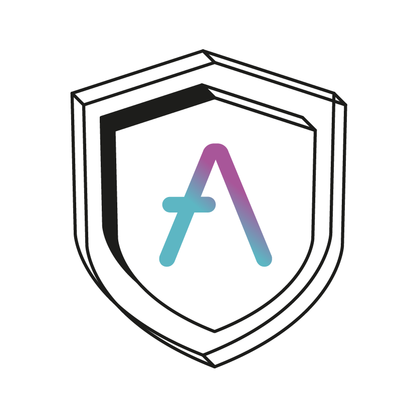

# Staked Token (Aave Safety Module) v1.5

<p align="center">

</p>

Repository contains a new revision of `StakedTokenV3` and `StakedAaveV3`, **equivalent to what is know high-level as Safety Module v1.5**.

It is important to highlight that stkAAVE and stkABPT are slightly different, that's the reason why the code intended to use for each one is:

- For stkAAVE: [StakedAaveV3](./src/contracts/StakedAaveV3.sol)
- For stkABPT: [StakedTokenV3](./src/contracts/StakedTokenV3.sol)

Due to complex inheritance chains, a aggregated interface for each Contract is provided as:

- [AggregatedStakedAaveV3](./src/interfaces/AggregatedStakedAaveV3.sol)
- [AggregatedStakedTokenV3](./src/interfaces/AggregatedStakedTokenV3.sol)

<br>

## Slashing

Thew new `StakedTokenV3` includes en enhanced mechanism to facilitate slashing of the underlying by tracking the `exchangeRate` between $stkToken \leftrightarrow Token$.

The slashing itself must be performed by a slashingAdmin which initially will be the governance short executor. The slashing will result in transferring part of the underlying to a specified address and starting the slashing process by setting a `inPostSlashingPeriod` flag.

While being in post slashing period, no other slashing can be performed. While accounts can exit the pool no-one can enter the pool in that period.

The community can then use (parts of) the funds for recovery. Once the recovery is finished potentially remaining funds should be returned to the pool and mutualized by the remaining stakers.

Once the slashing is officially settled, accounts can reenter the pool and a new slashing can occur.

<br>

## Cooldown & Redeeming

The new `StakedTokenV3` adjusts the cooldown to no longer cooldown for an arbitrary `balance`, but instead to cooldown for the minimum `balanceOf(account)` between cooldown start `t0` and withdrawal window end `t1`.

In practice this means, the cooldown will write the `redeem` budget to storage once `cooldown` is triggered and discount from it when there is a `redeem` action, or a `transfer out` performed.

While in the current system one can trigger a `cooldown` for e.g. `100` -> receive `100` and then `redeem(200)`(after a prolonged cooldown), with the newly introduced mechanic you will only ever be able to `redeem(100)`. If at any point during the cooldown period the `balanceOf(account)` decreases below the `redeem` budget registered on `cooldown` the budget will be decreased to the new `balanceOf(account)`.

<br>

## GHO

The `StakedAaveV3` extends on top of `StakedTokenV3` , by adding hooks for managing the GHO discounts via a "transfer hook".

An export of storage layout changes can be found [here](./storage.md)

<br>

## Security

**External**

- [SigmaPrime report](./audits/Sigma_Prime_Aave_Safety_Module_Security_Assessment_Report_v2.pdf)
- [Certora report](./audits/Certora_FV_Report.pdf)
- [Certora properties](./certora/specs/)

**Procedures followed**

- A more formal list of properties of the system can be found [HERE](./properties.md)
- An export of storage layout changes and code diff from the previous implementation can be found [HERE](./https://github.com/bgd-labs/aave-stk-slashing-mgmt/tree/main/diffs)
- The test suite of the implementation can be found [HERE](https://github.com/bgd-labs/aave-stk-slashing-mgmt/tree/main/tests)

<br>

## Development

### Install

```sh
cp .env.example .env
forge install
```

### Test

```sh
forge test
```

### Diff

Generate a code & storage layout diff.

```sh
make diff-all
```
